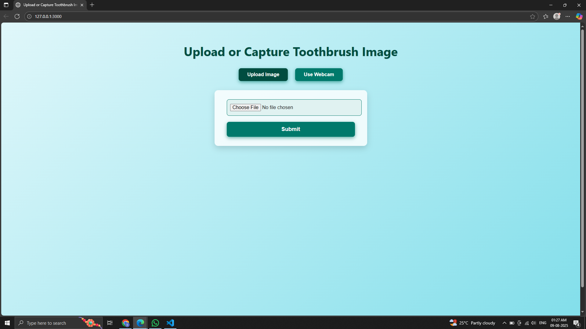
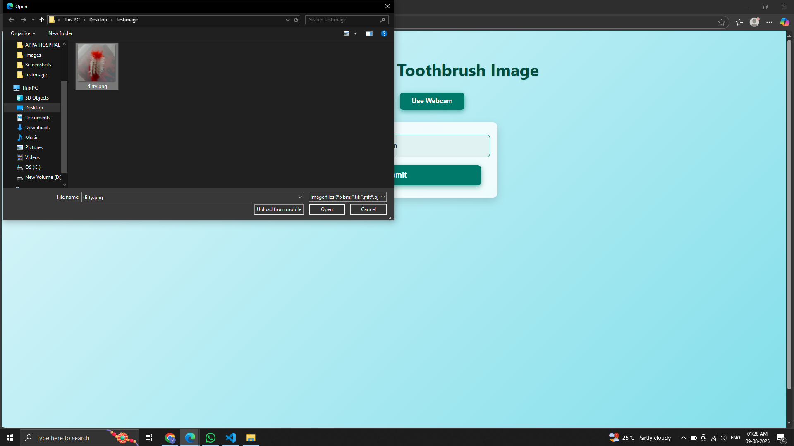
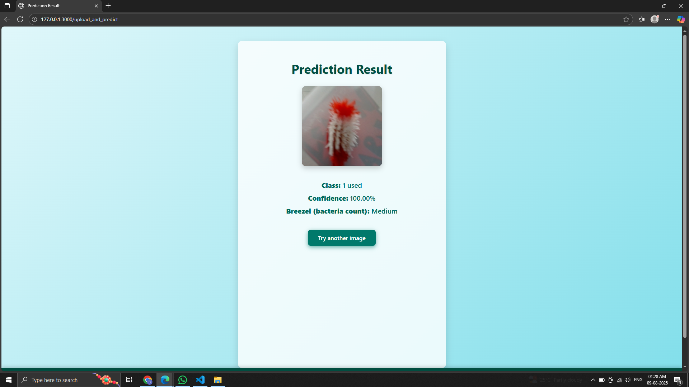
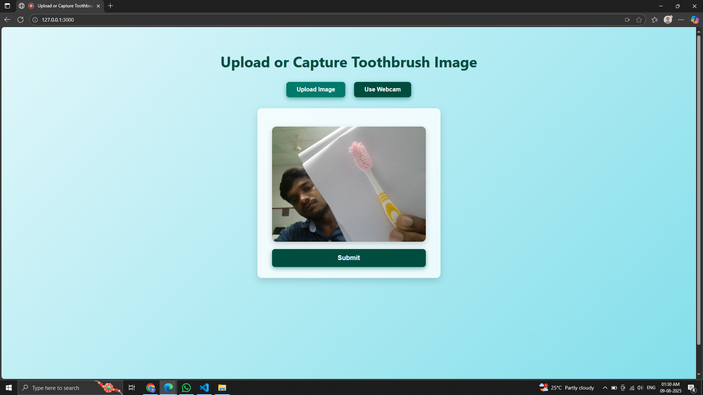
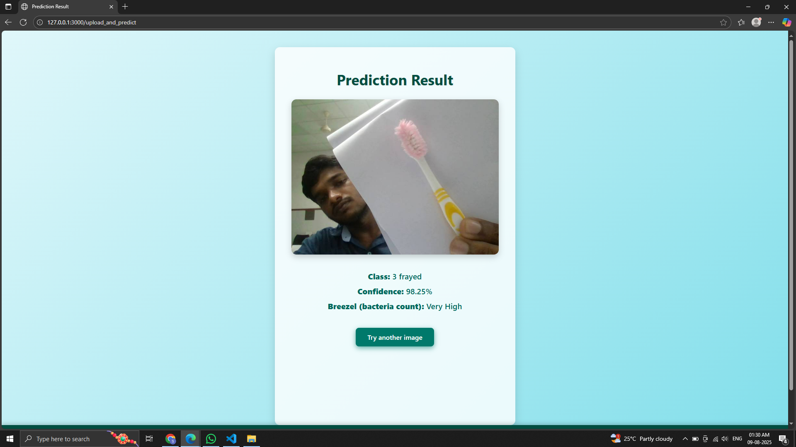

# Jhatpat BrushCheck🎯

## Basic Details
Jhatpat BrushCheck is a lightweight, AI-powered web application designed to help users quickly check the condition of their toothbrushes. With just a simple photo upload or webcam capture, the app classifies the toothbrush into one of four categories: New, Used, Dirty, or Frayed. It also provides an estimated bacteria level on the toothbrush, helping users understand when it's time to replace their brush for better oral hygiene.

The goal of Jhatpat BrushCheck is to promote better dental care by making it easy and fun for everyone to monitor their toothbrush condition regularly — without any technical hassle.
### Team Name: Null&Void

### Team Members
- Team Lead:Srinivas - LBS College of Engineering Kasaragod
- Member 2: Vidhath N Shetty - LBS College of Engineering Kasaragod

### Project Description
Jhatpat BrushCheck lets you quickly check your toothbrush’s condition with a simple photo. Using AI, it tells you if your brush is new, used, dirty, or frayed — plus an estimate of bacteria level. Keep your smile fresh with this fast and fun tool!

### The Problem (that doesn't exist)
People often ignore their toothbrush condition until it’s too late — risking yucky bacteria and bad breath!

### The Solution (that nobody asked for)
A quick, quirky web app that judges your toothbrush for you! Upload a photo and get instant feedback, so you never let your brush go bad unnoticed.

## Technical Details
### Technologies/Components Used
For Software:
- Python
- Flask (Web framework)
- Keras (AI model)
- HTML, CSS, JavaScript (Frontend)

For Hardware:
- Nil

### Implementation
For Software:
# Installation
pip install -r requirements.txt

# Run
python app.py

### Project Documentation
For Software:

# Screenshots (Add at least 3)

*This is the Home page*

*Uploading Image*

*Result of uploaded of Image*

*Uploading Image using WebCam*

*Resulr of WebCam uploaded Image using WebCam*

# Diagrams
- Nil

# Schematic & Circuit
- Nil

# Build Photos
- Nil

### Project Demo
# Video
[Add your demo video link here]
*Explain what the video demonstrates*

# Additional Demos
- Live demo link: https://jhatpatbrushcheck.example.com

## Team Contributions
- Srinivas: Model integration organising dataset and tarining, backend & frontend coding
- Vidhath N Shetty: Motivation

---
Made with ❤️ at TinkerHub Useless Projects 

